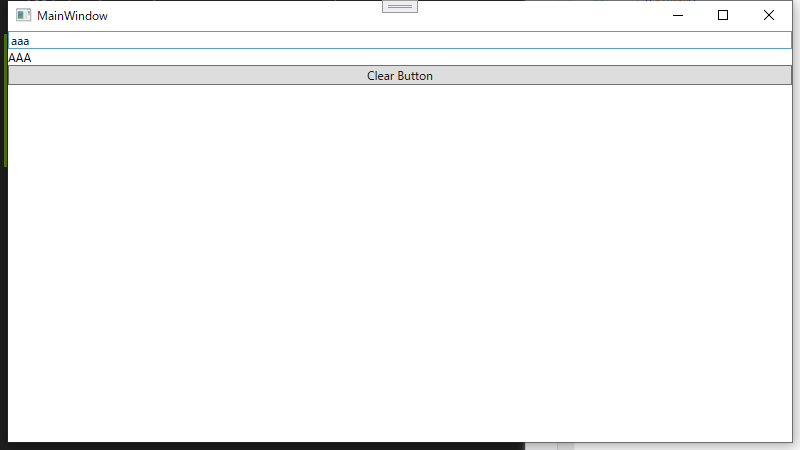
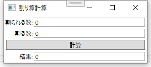
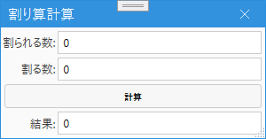

# Study-of-WPF
WPF勉強用のプロジェクト

## 環境
- Visual Studio 2019 16.9

---
## Case01
.NET5のプロジェクトを追加してみよう。  
  

NETSDK1173のワーニングがでるので抑制してください。  

---
## Case02
TextBlockをウィンドウに配置して『Hello world!!』と表示してみよう。  

---
## Case03
ViewとViewModelを理解する。  
Case02をDataBindingで実現してみよう。  
どういう形でも良いので、TextBlockに表示する文字列をDataBindingでViewModelのデータを表示するようにしてみてください。   

---
### Case04
INotifyPropertyChangedインターフェイスを理解する。  
以下のイメージで、TextBoxに入力された文字列を大文字に変換してリアルタイムでTextBlockコントロールに表示するようにしてみてください。

---
### Case05
ICommandインターフェイスを理解する。  
まずはTextBlockコントロールに表示されている文字列を、ボタン押下でDebug出力してみてください。  
それができたらボタン押下でTextBoxコントロールとTextBlockコントロールに表示されている文字をクリアできるようにしてみてください。  

---
### Case06
割り算を実行できる簡単なアプリを作ってみる。  
数値入力可能なテキストボックスを2個、結果を表示するテキストボックスを1個、割り算の実行をトリガするボタンを1個。  
ボタンを押されたら割り算を実行して結果を表示できるようにしてみてください。  
新しい要素はないのでこれまでのおさらいのイメージ。  

---
### Case07
Case06で作ったアプリケーションの改善。  
エラー処理を実装してみましょう。  
計算ボタンが押下された際に、割る数が0だった場合はエラーメッセージを表示するようにしてください。  
実装はコードビハインドに書かないように。  

---
### Case08
UIの見た目を改善。  
キャプチャのサンプルでは以下のパッケージを使用しました。  
* [MahApp](https://mahapps.com/)
* [MaterialDesign](https://github.com/MaterialDesignInXAML/MaterialDesignInXamlToolkit)

