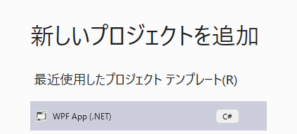
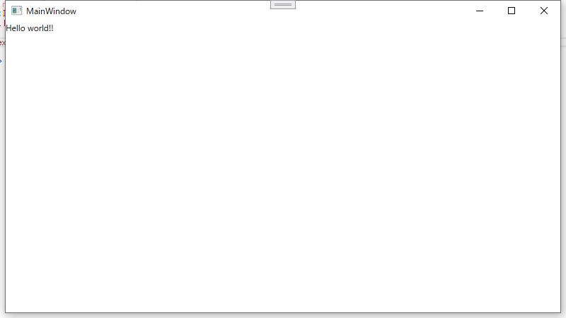
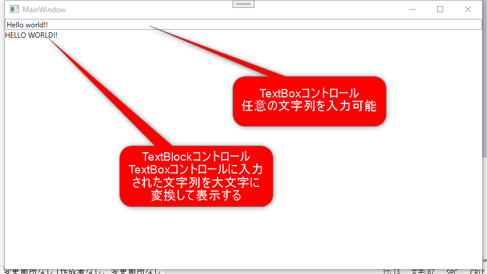

# Study-of-WPF
WPF勉強用のプロジェクト

## 環境
- Visual Studio 2019 16.9

---
## Case01
.NET5のプロジェクトを追加してみよう。  
  

NETSDK1173のワーニングがでるので抑制してください。  

---
## Case02
TextBlockをウィンドウに配置して『Hello world!!』と表示してみよう。  

---
## Case03
ViewとViewModelを理解する。  
Case02をDataBindingで実現してみよう。  
どういう形でも良いので、TextBlockに表示する文字列をDataBindingでViewModelのデータを表示するようにしてみてください。   

---
### Case04
INotifyPropertyChangedインターフェイスを理解する。  
以下のイメージで、TextBoxに入力された文字列を大文字に変換してリアルタイムでTextBlockコントロールに表示するようにしてみてください。  

